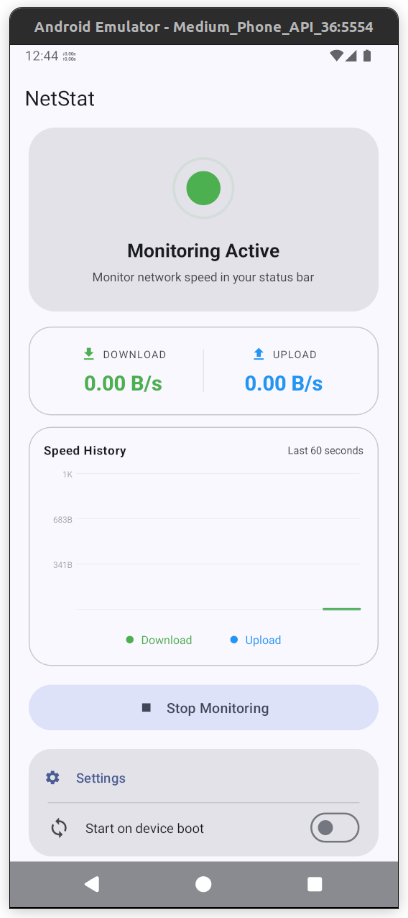
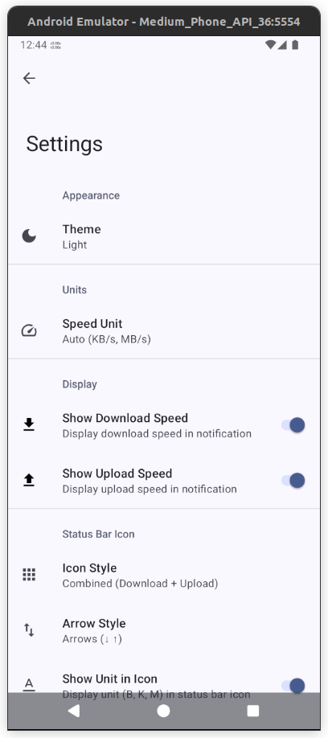

# NetStat - Network Speed Monitor

[](https://github.com/MatanelP/net-stat/actions/workflows/build.yml)
[](https://developer.android.com/about/versions/pie)
[](https://kotlinlang.org)
[](LICENSE)

A modern Android app that displays real-time network speed (download/upload) in your status bar notification, with a live speed graph and full Material You theming.

<p align="center">
  
  
</p>

## Features

- 📊 **Real-time Monitoring** — Live download and upload speed displayed in the status bar
- 📈 **Speed History Graph** — Smooth real-time graph tracking download and upload speed over the last 60 seconds, with toggleable lines
- 🎨 **Material You Design** — Dynamic colors that match your wallpaper (Android 12+)
- 🌗 **Theme Modes** — Light, Dark, or System default
- ✨ **Smooth Animations** — Pulsing status indicator, staggered card entrances, and animated transitions
- ⚙️ **Highly Customizable Status Bar Icon**
  - Speed units (Auto, Kbps, Mbps, KB/s, MB/s)
  - Icon style (Combined, Download only, Upload only)
  - Arrow styles (↓↑, ▼▲, DU, or none)
  - Text color (White, Black, Green, Cyan, Yellow, Red, Orange)
  - Font size and font style (Normal, Bold, Italic, Bold Italic)
  - Show/hide unit in icon
  - Minimize notification
- 🚀 **Start on Boot** — Optionally start monitoring when device boots
- 🔋 **Battery Efficient** — Lightweight foreground service with smart zero-threshold to prevent flickering

## Requirements

- Android 9.0 (API 28) or higher
- Notification permission (Android 13+)

## Installation

### From Google Play
Coming soon.

### From Releases
1. Download the latest APK from [Releases](https://github.com/MatanelP/net-stat/releases)
2. Install on your Android device
3. Grant notification permission when prompted

### Build from Source
```bash
# Clone the repository
git clone https://github.com/MatanelP/net-stat.git
cd net-stat

# Build debug APK
./gradlew assembleDebug

# Install on connected device
./gradlew installDebug
```

## Usage

1. Open the app
2. Tap **"Start Monitoring"**
3. Grant notification permission if prompted
4. Network speed will appear in your status bar and on the main screen
5. Watch the live speed graph fill in over 60 seconds
6. Tap the graph legend labels to show/hide download or upload lines
7. Customize appearance and theme in **Settings**

## Tech Stack

- **Language**: Kotlin 2.1.0
- **UI**: Material 3 / Material You with dynamic colors
- **Architecture**: Android Services + LocalBroadcastManager
- **Build**: Gradle 8.11.1 + AGP 8.7.3
- **Min SDK**: 28 (Android 9)
- **Target SDK**: 36 (Android 16)

## Contributing

Contributions are welcome! Please feel free to submit a Pull Request.

## License

This project is licensed under the MIT License - see the [LICENSE](LICENSE) file for details.

## Acknowledgments

- [Material Design 3](https://m3.material.io/) for design guidelines
- Android team for the excellent TrafficStats API
